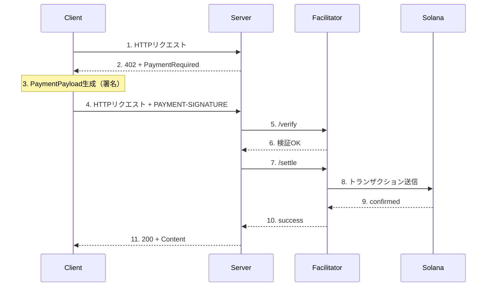
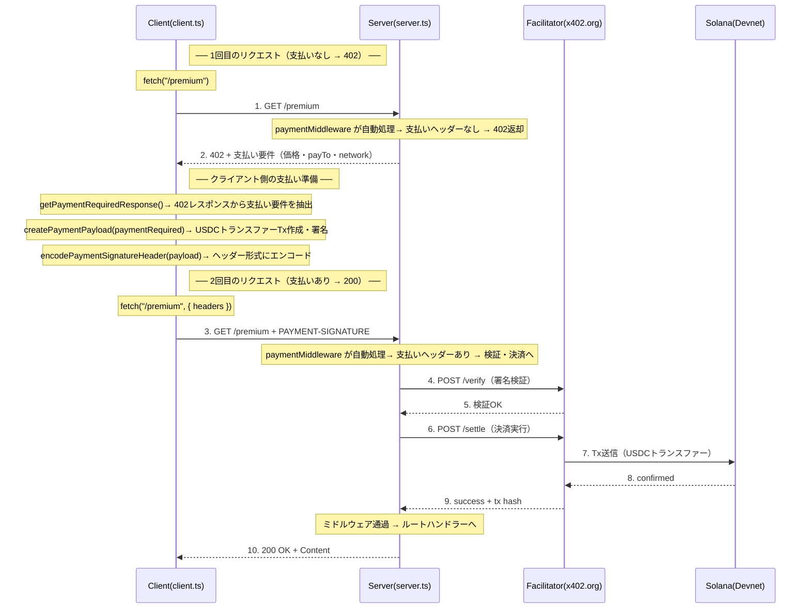

# Solana Bootcamp - x402 on Solana シーケンス図

BOOTCAMP_PLOT_WITH_COMMENTS_WITH_EXPRESS_SDK.md で使用する図の一覧です。

---

## 3. アーキテクチャ：Facilitatorの役割

---

## 4-0. ハンズオンで作成するシステムのフロー

---

## 5-0. クライアント実装の概要

