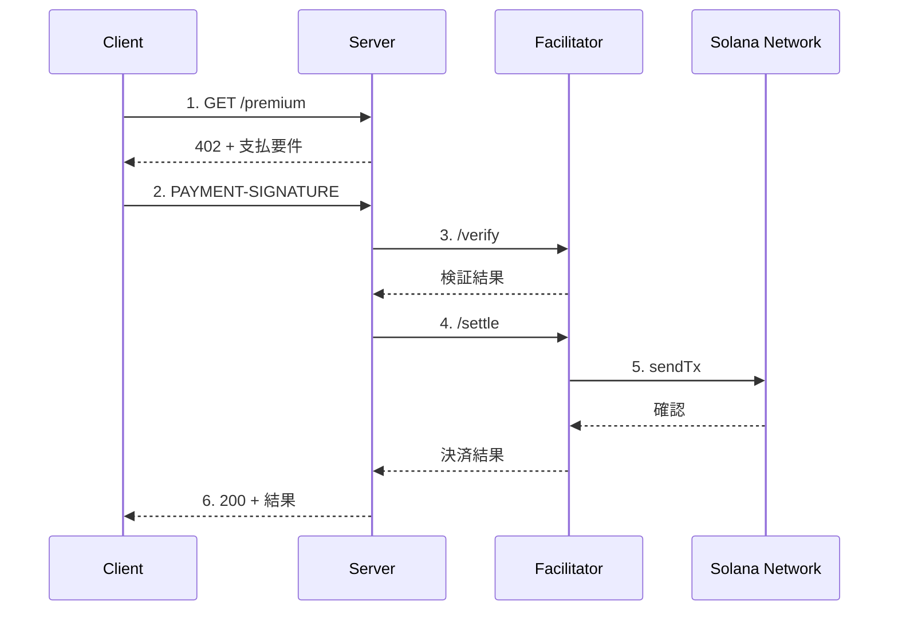

# Kit + Facilitator + @x402 公式パッケージ版

Coinbase公式の `@x402/svm` と `@x402/core` パッケージを使用した **推奨実装** です。

## 概要

| 項目 | 内容 |
|------|------|
| SDK | `@solana/kit` + `@x402/svm` + `@x402/core` |
| プロトコル | x402 v2 |
| トランザクション送信 | Facilitator経由（ガスレス） |
| 推奨用途 | **本番環境** |

### 利点

- 公式パッケージによる正しいx402プロトコル実装
- 自動的なヘッダーエンコード/デコード
- V1/V2両方のプロトコルサポート
- 型安全性

### フロー図



## セットアップ

```bash
cd kit-facilitator-cdp
npm install
cp env.example .env
# .env を編集して RECIPIENT_WALLET を設定
```

## 実行方法

```bash
# サーバー起動
npx tsx server.sample.ts

# 別ターミナルでクライアント実行
npx tsx client.sample.ts
```

## ファイル構成

| ファイル | 説明 |
|---------|------|
| `server.ts` | サーバー（テンプレート） |
| `client.ts` | クライアント（テンプレート） |
| `server.sample.ts` | サーバー完成版 |
| `client.sample.ts` | クライアント完成版 |

## 重要な補足事項

### `payTo` にはウォレットアドレスを指定

**`payTo` にはATAではなくウォレットアドレスを指定してください。**

```typescript
// 正しい
payTo: RECIPIENT_WALLET as string,  // ウォレットアドレス

// 間違い（エラーになる）
payTo: recipientTokenAccount as string,  // ATA
```

**理由**: `@x402/svm` ライブラリは内部で以下のようにATAを計算します：

```typescript
const [destinationATA] = await findAssociatedTokenPda({
  mint: paymentRequirements.asset,
  owner: paymentRequirements.payTo,  // payTo を owner として使用
  tokenProgram: tokenProgramAddress
});
```

ATAを渡すと「ATAのATA」を計算しようとして `InvalidAccountData` エラーになります。

> 参考: [x402 SVM Specification](https://github.com/coinbase/x402/blob/main/specs/schemes/exact/scheme_exact_svm.md)
> - "Destination MUST equal the Associated Token Account PDA for (owner = payTo, mint = asset)"

### USDC Mintは自動選択

`@x402/svm` はネットワークに応じてUSDC Mintを自動選択します：

| ネットワーク | USDC Mint |
|-------------|-----------|
| Devnet | `4zMMC9srt5Ri5X14GAgXhaHii3GnPAEERYPJgZJDncDU` |
| Mainnet | `EPjFWdd5AufqSSqeM2qN1xzybapC8G4wEGGkZwyTDt1v` |

### 価格の指定形式

ドル形式で指定可能：

```typescript
price: "$0.01"      // 0.01 USDC
price: "$1.50"      // 1.50 USDC
price: "0.001"      // 0.001 USDC（$なしも可）
```

## コード例

### サーバー側

```typescript
import { x402ResourceServer, HTTPFacilitatorClient } from "@x402/core/server";
import { x402HTTPResourceServer } from "@x402/core/http";
import { ExactSvmScheme } from "@x402/svm/exact/server";

const facilitatorClient = new HTTPFacilitatorClient({
  url: "https://x402.org/facilitator",
});

const resourceServer = new x402ResourceServer(facilitatorClient)
  .register("solana:*", new ExactSvmScheme());

const routes = {
  "GET /premium": {
    accepts: {
      scheme: "exact",
      network: "solana:EtWTRABZaYq6iMfeYKouRu166VU2xqa1",
      payTo: RECIPIENT_WALLET as string,  // ウォレットアドレス
      price: "$0.01",
    },
  },
};

const httpServer = new x402HTTPResourceServer(resourceServer, routes);
await httpServer.initialize();
```

### クライアント側

```typescript
import { x402Client } from "@x402/core/client";
import { x402HTTPClient } from "@x402/core/http";
import { toClientSvmSigner } from "@x402/svm";
import { registerExactSvmScheme } from "@x402/svm/exact/client";

const signer = toClientSvmSigner(keypair);
const coreClient = new x402Client();
registerExactSvmScheme(coreClient, { signer });
const client = new x402HTTPClient(coreClient);

// 402レスポンスから支払い要件を抽出
const paymentRequired = client.getPaymentRequiredResponse(
  (name) => response.headers.get(name),
  body
);

// 支払いペイロードを作成
const paymentPayload = await client.createPaymentPayload(paymentRequired);

// 支払いヘッダーをエンコード
const paymentHeaders = client.encodePaymentSignatureHeader(paymentPayload);
```

## ヘッダー形式

| バージョン | 送信ヘッダー | レスポンスヘッダー |
|-----------|-------------|-------------------|
| v2 | `PAYMENT-SIGNATURE` | `PAYMENT-RESPONSE` |
| v1 | `X-PAYMENT` | `X-PAYMENT-RESPONSE` |

## 対応ネットワーク

| ネットワーク | CAIP-2識別子 | Facilitator |
|-------------|-------------|-------------|
| Solana Devnet | `solana:EtWTRABZaYq6iMfeYKouRu166VU2xqa1` | x402.org |
| Solana Mainnet | `solana:5eykt4UsFv8P8NJdTREpY1vzqKqZKvdp` | CDP |

## トラブルシューティング

### `InvalidAccountData` エラー

`payTo` にATAを指定している可能性があります。ウォレットアドレスを指定してください。

### `transaction_simulation_failed` エラー

- 受取先のToken Accountが存在するか確認
- クライアントのUSDC残高が十分か確認

## 参考リンク

- [x402 公式サイト](https://www.x402.org/)
- [x402 GitHub](https://github.com/coinbase/x402)
- [@x402/svm NPM](https://www.npmjs.com/package/@x402/svm)
- [@x402/core NPM](https://www.npmjs.com/package/@x402/core)
- [x402 SVM Specification](https://github.com/coinbase/x402/blob/main/specs/schemes/exact/scheme_exact_svm.md)
