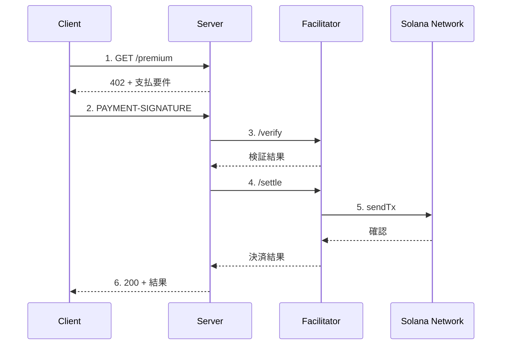

# Kit + Facilitator + @x402 リファレンス

## フロー図



## コード例

### サーバー側

```typescript
import { x402ResourceServer, HTTPFacilitatorClient } from "@x402/core/server";
import { x402HTTPResourceServer } from "@x402/core/http";
import { ExactSvmScheme } from "@x402/svm/exact/server";

const facilitatorClient = new HTTPFacilitatorClient({
  url: "https://x402.org/facilitator",
});

const resourceServer = new x402ResourceServer(facilitatorClient)
  .register("solana:*", new ExactSvmScheme());

const routes = {
  "GET /premium": {
    accepts: {
      scheme: "exact",
      network: "solana:EtWTRABZaYq6iMfeYKouRu166VU2xqa1",
      payTo: RECIPIENT_WALLET as string,  // ウォレットアドレス
      price: "$0.01",
    },
  },
};

const httpServer = new x402HTTPResourceServer(resourceServer, routes);
await httpServer.initialize();
```

### クライアント側

```typescript
import { x402Client } from "@x402/core/client";
import { x402HTTPClient } from "@x402/core/http";
import { toClientSvmSigner } from "@x402/svm";
import { registerExactSvmScheme } from "@x402/svm/exact/client";

const signer = toClientSvmSigner(keypair);
const coreClient = new x402Client();
registerExactSvmScheme(coreClient, { signer });
const client = new x402HTTPClient(coreClient);

// 402レスポンスから支払い要件を抽出
const paymentRequired = client.getPaymentRequiredResponse(
  (name) => response.headers.get(name),
  body
);

// 支払いペイロードを作成
const paymentPayload = await client.createPaymentPayload(paymentRequired);

// 支払いヘッダーをエンコード
const paymentHeaders = client.encodePaymentSignatureHeader(paymentPayload);
```

## ヘッダー形式

| バージョン | 送信ヘッダー | レスポンスヘッダー |
|-----------|-------------|-------------------|
| v2 | `PAYMENT-SIGNATURE` | `PAYMENT-RESPONSE` |
| v1 | `X-PAYMENT` | `X-PAYMENT-RESPONSE` |

## 対応ネットワーク

| ネットワーク | CAIP-2識別子 | Facilitator |
|-------------|-------------|-------------|
| Solana Devnet | `solana:EtWTRABZaYq6iMfeYKouRu166VU2xqa1` | x402.org |
| Solana Mainnet | `solana:5eykt4UsFv8P8NJdTREpY1vzqKqZKvdp` | CDP |

## USDC Mint（自動選択）

| ネットワーク | USDC Mint |
|-------------|-----------|
| Devnet | `4zMMC9srt5Ri5X14GAgXhaHii3GnPAEERYPJgZJDncDU` |
| Mainnet | `EPjFWdd5AufqSSqeM2qN1xzybapC8G4wEGGkZwyTDt1v` |
