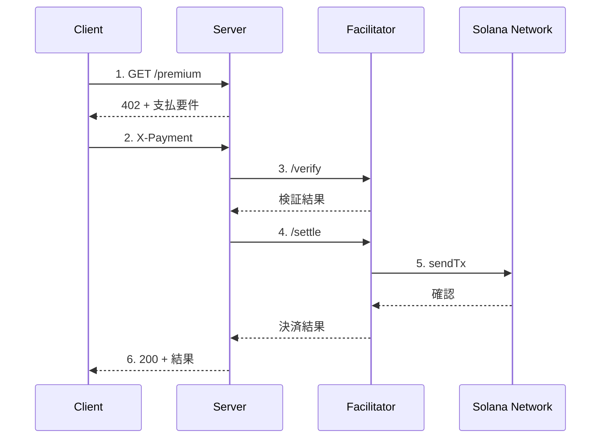

# Kit + Facilitator版（手動実装）

`@solana/kit` と Coinbase Facilitator を使用した x402 v2 の **手動実装** です。

## 概要

| 項目 | 内容 |
|------|------|
| SDK | `@solana/kit` + `@solana-program/token` |
| プロトコル | x402 v2（手動実装） |
| トランザクション送信 | Facilitator経由（ガスレス） |
| 推奨用途 | x402プロトコルの学習・理解 |

### このディレクトリの目的

公式パッケージを使わずにx402プロトコルを手動実装することで、プロトコルの内部動作を理解できます。

**本番環境では `kit-facilitator-cdp/` の公式パッケージ版を推奨します。**

## x402 v2 プロトコル概要

### CAIP-2 ネットワーク識別子

x402 v2は[CAIP-2](https://github.com/ChainAgnostic/CAIPs/blob/main/CAIPs/caip-2.md)形式でネットワークを識別します。

```typescript
// Solana
"solana:EtWTRABZaYq6iMfeYKouRu166VU2xqa1"  // Devnet
"solana:5eykt4UsFv8P8NJdTREpY1vzqKqZKvdp"  // Mainnet

// EVM
"eip155:84532"   // Base Sepolia
"eip155:8453"    // Base Mainnet
```

### フロー図



## セットアップ

```bash
cd kit-facilitator
npm install
cp env.example .env
# .env を編集
```

### 環境変数

| 変数 | 説明 | 例 |
|------|------|-----|
| `RECIPIENT_WALLET` | 受取先ウォレット | `4pHdN9Q...` |
| `USDC_MINT` | USDC Mintアドレス | Devnet: `4zMMC9srt5Ri5X14GAgXhaHii3GnPAEERYPJgZJDncDU` |
| `FACILITATOR_URL` | FacilitatorのURL | `https://x402.org/facilitator` |
| `SOLANA_NETWORK` | ネットワーク | `devnet` or `mainnet` |

## 実行方法

```bash
# サーバー起動
npx tsx server.sample.ts

# 別ターミナルでクライアント実行
npx tsx client.sample.ts
```

## ファイル構成

| ファイル | 説明 |
|---------|------|
| `server.ts` | サーバー（テンプレート） |
| `client.ts` | クライアント（テンプレート） |
| `server.sample.ts` | サーバー完成版 |
| `client.sample.ts` | クライアント完成版 |

## 重要な補足事項

### 手動実装 vs 公式パッケージ

| 項目 | 手動実装（このディレクトリ） | 公式パッケージ（kit-facilitator-cdp） |
|------|----------------------------|---------------------------------------|
| ヘッダー処理 | 手動でエンコード/デコード | 自動 |
| 型安全性 | 手動で定義 | 提供される |
| V1/V2対応 | 実装次第 | 自動 |
| メンテナンス | 自己責任 | Coinbaseが維持 |

### Facilitatorエンドポイント

| 環境 | URL | 備考 |
|------|-----|------|
| テスト | `https://x402.org/facilitator` | APIキー不要 |
| 本番 | `https://api.cdp.coinbase.com/platform/v2/x402` | CDP APIキー必要 |

### 402レスポンス形式

```json
{
  "x402Version": 2,
  "accepts": [{
    "scheme": "exact",
    "network": "solana:EtWTRABZaYq6iMfeYKouRu166VU2xqa1",
    "maxAmountRequired": "100",
    "asset": "4zMMC9srt5Ri5X14GAgXhaHii3GnPAEERYPJgZJDncDU",
    "payTo": "...",
    "maxTimeoutSeconds": 60
  }]
}
```

### Facilitator API

#### POST /verify

```typescript
// リクエスト
{
  x402Version: 2,
  paymentPayload: string,  // Base64エンコード
  paymentRequirements: PaymentRequirements
}

// レスポンス
{
  isValid: boolean,
  invalidReason?: string,
  payer?: string
}
```

#### POST /settle

```typescript
// リクエスト
{
  x402Version: 2,
  paymentPayload: string,
  paymentRequirements: PaymentRequirements
}

// レスポンス
{
  success: boolean,
  transaction?: string,
  network?: string,
  errorMessage?: string
}
```

## 対応ネットワーク

| ネットワーク | CAIP-2識別子 | Facilitator |
|-------------|-------------|-------------|
| Solana Devnet | `solana:EtWTRABZaYq6iMfeYKouRu166VU2xqa1` | x402.org |
| Solana Mainnet | `solana:5eykt4UsFv8P8NJdTREpY1vzqKqZKvdp` | CDP |
| Base Sepolia | `eip155:84532` | x402.org |
| Base Mainnet | `eip155:8453` | CDP |

## 参考リンク

- [x402 公式サイト](https://www.x402.org/)
- [x402 GitHub](https://github.com/coinbase/x402)
- [x402 エコシステム](https://www.x402.org/ecosystem)
- [CAIP-2 仕様](https://github.com/ChainAgnostic/CAIPs/blob/main/CAIPs/caip-2.md)
- [CDP ドキュメント](https://docs.cdp.coinbase.com/)
