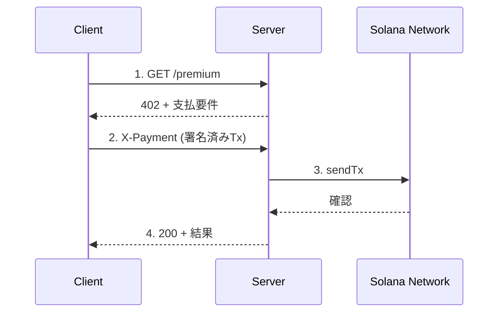

# Kit版（直接送信）

`@solana/kit` を使用した **Facilitatorなし** の直接送信実装です。

## 概要

| 項目 | 内容 |
|------|------|
| SDK | `@solana/kit` + `@solana-program/token` |
| プロトコル | x402 v1（シンプル版） |
| トランザクション送信 | サーバーが直接ブロックチェーンに送信 |
| 推奨用途 | 学習・プロトタイプ |

### フロー図



## セットアップ

```bash
cd kit
npm install
cp .env.example .env
# .env を編集して RECIPIENT_WALLET を設定
```

## 実行方法

```bash
# サーバー起動
npx tsx server.sample.ts

# 別ターミナルでクライアント実行
npx tsx client.sample.ts
```

**注意**: `client.json` と `server.json` はルートディレクトリに配置してください。

## ファイル構成

| ファイル | 説明 |
|---------|------|
| `server.ts` | サーバー（テンプレート） |
| `client.ts` | クライアント（テンプレート） |
| `server.sample.ts` | サーバー完成版 |
| `client.sample.ts` | クライアント完成版 |

## 重要な補足事項

### 直接送信 vs Facilitator経由

| 項目 | 直接送信（このディレクトリ） | Facilitator経由 |
|------|----------------------------|-----------------|
| トランザクション送信 | サーバーが送信 | Facilitatorが送信 |
| ガス代 | クライアント負担 | Facilitator負担（ガスレス可能） |
| 検証 | サーバーが実装 | Facilitatorが実施 |
| セキュリティ | 自己実装 | プロトコル標準 |

### @solana/kit について

`@solana/kit` は Solana の新しい JavaScript SDK です。

```typescript
// 接続
import { createSolanaRpc } from "@solana/kit";
const rpc = createSolanaRpc("https://api.devnet.solana.com");

// キーペア
import { createKeyPairSignerFromBytes } from "@solana/kit";
const signer = await createKeyPairSignerFromBytes(keypairBytes);

// アドレス
import { address } from "@solana/kit";
const pubkey = address("4pHdN9Q7NUoKgXFAV59AqWqoh86jcHXYJEhtsHXutj7k");
```

### @solana/web3.js からの移行

| 旧 (@solana/web3.js) | 新 (@solana/kit) |
|---------------------|------------------|
| `new Connection(url)` | `createSolanaRpc(url)` |
| `Keypair.fromSecretKey()` | `createKeyPairSignerFromBytes()` |
| `new PublicKey(str)` | `address(str)` |
| `publicKey.toBase58()` | そのまま文字列 |

### トークン操作

`@solana-program/token` を使用：

```typescript
import { findAssociatedTokenPda, getTransferInstruction } from "@solana-program/token";

// ATA取得
const [ata] = await findAssociatedTokenPda({
  mint: USDC_MINT,
  owner: walletAddress,
  tokenProgram: TOKEN_PROGRAM_ADDRESS,
});

// 送金
const transferIx = getTransferInstruction({
  source: sourceAta,
  destination: destAta,
  authority: signer,
  amount: 100n,
});
```

## Devnet USDC

| 項目 | 値 |
|------|-----|
| Mint | `4zMMC9srt5Ri5X14GAgXhaHii3GnPAEERYPJgZJDncDU` |
| 小数点 | 6桁 |
| Faucet | [Circle Faucet](https://faucet.circle.com/) |

## トラブルシューティング

### `InvalidAccountData` エラー

受取先のToken Account（ATA）が存在するか確認：

```bash
spl-token create-account 4zMMC9srt5Ri5X14GAgXhaHii3GnPAEERYPJgZJDncDU \
  --owner $(solana-keygen pubkey ../server.json) \
  --fee-payer ../server.json
```

### TypeScriptエラー

```bash
npm install --save-dev @types/express @types/node
```

## 注意事項

- このディレクトリはFacilitatorを使用しないシンプルな実装です
- 本番環境では `kit-facilitator-cdp/` の使用を推奨します
- クライアントがガス代を負担します

## 参考リンク

- [@solana/kit NPM](https://www.npmjs.com/package/@solana/kit)
- [@solana-program/token NPM](https://www.npmjs.com/package/@solana-program/token)
- [Solana公式ガイド: x402](https://solana.com/ja/developers/guides/getstarted/intro-to-x402)
